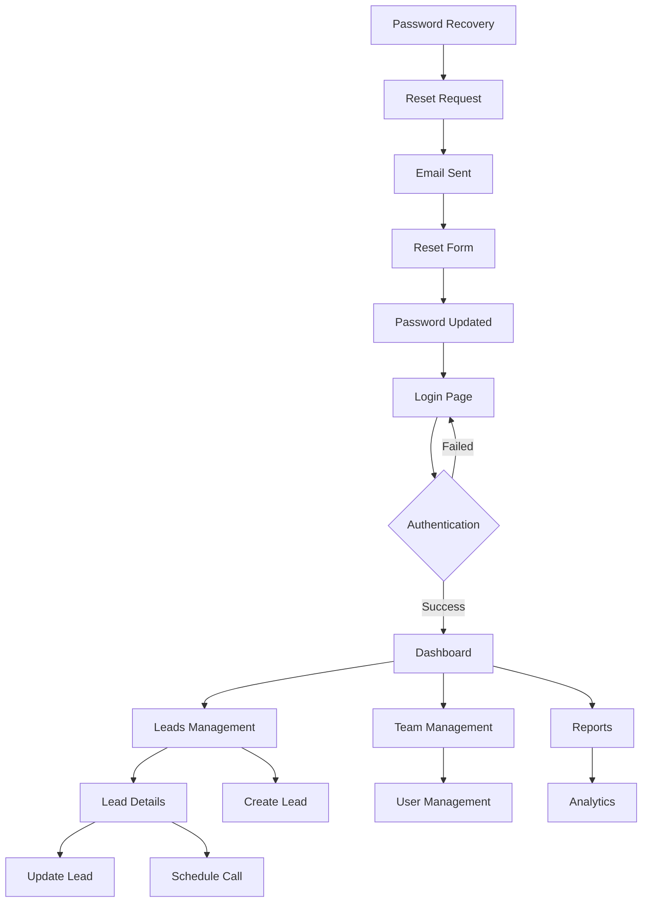

## 1. Product Overview

A comprehensive production-ready web application for real estate lead management with secure authentication, advanced lead tracking, and professional UI/UX. The platform enables real estate professionals to efficiently manage leads, track interactions, and streamline their sales pipeline.

- Solves the problem of scattered lead management and inefficient tracking systems
- Target users: Real estate investors, acquisition managers, calling teams, and administrative staff
- Provides centralized lead management with role-based access and comprehensive reporting

## 2. Core Features

### 2.1 User Roles

| Role | Registration Method | Core Permissions |
|------|---------------------|------------------|
| Admin | Manual creation or invitation | Full system access, user management, system configuration |
| Acquisitions Manager | Admin invitation | Lead assignment, team oversight, reporting access |
| Caller | Admin invitation | Lead calling, scheduling, basic lead management |
| Investor | Admin invitation | Lead viewing, basic interaction, limited editing |

### 2.2 Feature Module

The application consists of the following main pages:

1. **Login Page**: Secure authentication with email/password, validation, and error handling
2. **Sign-up Page**: User registration with name, email, password confirmation
3. **Password Recovery**: Email-based password reset functionality
4. **Dashboard**: Overview with key metrics, recent activities, and quick actions
5. **Leads Management**: Full CRUD operations, filtering, sorting, and bulk actions
6. **Lead Details**: Individual lead view with interaction history and notes
7. **Team Management**: User administration and role assignment
8. **Reports**: Analytics dashboard with performance metrics
9. **Settings**: User profile management and system configuration

### 2.3 Page Details

| Page Name | Module Name | Feature description |
|-----------|-------------|---------------------|
| Login Page | Authentication Form | Validate email/password inputs, display error messages, implement JWT token handling, include "Remember Me" functionality, provide link to password recovery |
| Login Page | Security Features | Rate limiting protection, CAPTCHA after failed attempts, secure password hashing, session timeout handling |
| Sign-up Page | Registration Form | Collect name, email, password, password confirmation, validate email format, enforce password complexity requirements |
| Sign-up Page | Validation | Real-time password strength indicator, email availability check, password match validation, terms acceptance |
| Password Recovery | Reset Request | Email input with validation, send reset link functionality, success/error messaging, return to login link |
| Password Recovery | Reset Form | New password input, confirmation field, password validation, automatic login after reset |
| Dashboard | Metrics Overview | Display total leads, conversion rates, recent activities, pending tasks, performance charts |
| Dashboard | Quick Actions | Create new lead, view today's calls, access reports, view assigned leads |
| Leads Management | Lead List | Display all leads in table format, show key information (name, status, assigned to, last contact) |
| Leads Management | Filtering System | Filter by status, assigned user, date range, property type, motivation level, source |
| Leads Management | Sorting Options | Sort by name, date created, last contact, property value, status, assigned user |
| Leads Management | Bulk Actions | Select multiple leads, bulk status updates, bulk assignment, bulk export functionality |
| Leads Management | Search Functionality | Real-time search by name, address, phone, email, notes content |
| Lead Details | Information Display | Show complete lead information, property details, contact information, financial data |
| Lead Details | Status Management | Update lead status, motivation level, add notes, schedule follow-ups |
| Lead Details | Interaction History | View all calls, notes, status changes, timeline of activities |
| Lead Details | Action Buttons | Call lead, schedule appointment, send email, assign to team member |
| Team Management | User List | Display all users with roles, contact information, activity status |
| Team Management | User Actions | Add new user, edit user details, change roles, deactivate/reactivate accounts |
| Reports | Analytics Dashboard | Lead conversion rates, team performance, call statistics, revenue tracking |
| Reports | Export Functionality | Export reports as CSV, PDF, schedule automated reports |
| Settings | Profile Management | Update personal information, change password, notification preferences |
| Settings | System Configuration | Admin-only settings for system behavior, integrations, backup settings |

## 3. Core Process

### User Authentication Flow
1. User accesses login page → Enters credentials → System validates → JWT token issued → Redirect to dashboard
2. Password recovery → Email submitted → Reset link sent → User clicks link → New password set → Auto-login
3. New user registration → Admin invitation → User completes registration → Role assigned → Access granted

### Lead Management Flow
1. Lead creation → Data entry → Assignment to team member → Initial contact attempt → Status update
2. Lead interaction → Call/communication → Notes added → Status change → Follow-up scheduled
3. Lead conversion → Negotiation → Under contract → Closed deal → Performance tracking

### Team Collaboration Flow
1. Lead assignment → Admin assigns to caller → Caller receives notification → Caller contacts lead → Updates recorded
2. Performance monitoring → Activity tracking → Metrics calculation → Report generation → Performance review

## 4. User Interface Design

### 4.1 Design Style
- **Primary Colors**: Professional blue (#2563eb) for primary actions, gray (#6b7280) for secondary elements
- **Secondary Colors**: Green (#10b981) for success states, red (#ef4444) for errors, yellow (#f59e0b) for warnings
- **Button Style**: Rounded corners (8px radius), consistent padding (12px 24px), hover effects with transitions
- **Typography**: Inter font family, 16px base size, proper hierarchy (14px small, 18px large, 24px headings)
- **Layout Style**: Card-based design with consistent spacing, left sidebar navigation, top header bar
- **Icons**: Lucide React icons for consistency, proper sizing (20px default, 24px for CTAs)

### 4.2 Page Design Overview

| Page Name | Module Name | UI Elements |
|-----------|-------------|-------------|
| Login Page | Authentication Card | Centered card with logo, form inputs with icons, primary CTA button, muted background with gradient |
| Dashboard | Header Section | Welcome message, user avatar, notifications icon, logout button in top-right corner |
| Dashboard | Metrics Cards | Grid layout with KPI cards, progress indicators, trend arrows, consistent card styling |
| Leads Management | Data Table | Sortable columns, row hover effects, action buttons per row, pagination controls |
| Lead Details | Information Panels | Tabbed interface for different sections, form inputs with labels, save/cancel actions |
| Navigation | Sidebar Menu | Collapsible left panel with icons, active state highlighting, smooth transitions |

### 4.3 Responsiveness
- **Desktop-First Approach**: Optimized for 1920x1080 and 1366x768 resolutions
- **Mobile Adaptation**: Responsive breakpoints at 768px and 480px
- **Touch Optimization**: Larger tap targets (minimum 44px), swipe gestures for mobile navigation
- **Content Adaptation**: Horizontal scrolling prevention, vertical scrolling optimization, flexible grid layouts