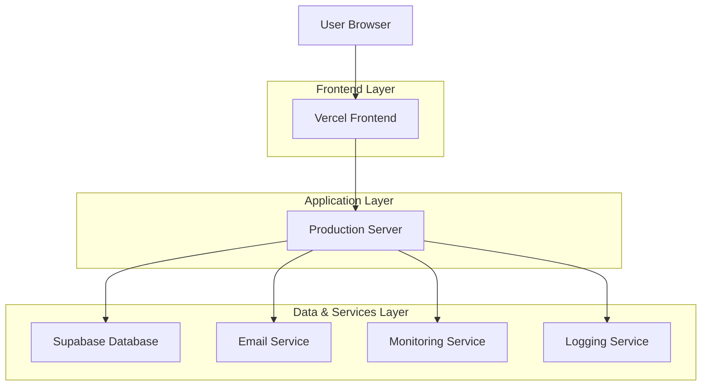
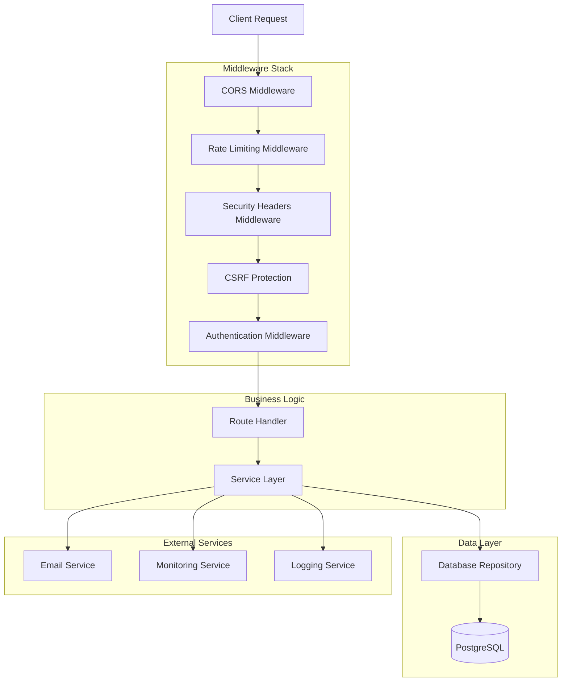
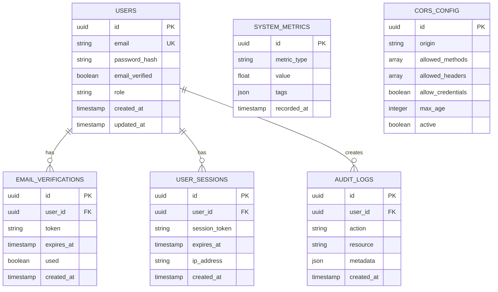

## 1. Architecture Design



## 2. Technology Description

- **Frontend**: React@18 + TypeScript + TailwindCSS@3 + Vite
- **Backend**: Node.js@20 + Express@4 + TypeScript
- **Database**: Supabase (PostgreSQL) with connection pooling
- **Email Service**: SendGrid API with custom templates
- **Monitoring**: Custom health check endpoints + external monitoring
- **Logging**: Winston@3 with structured JSON logging
- **Initialization Tool**: vite-init

## 3. Route Definitions

| Route | Purpose |
|-------|---------|
| /health | Health check endpoint for system status |
| /health/metrics | Detailed system metrics and performance data |
| /auth/verify-email | Email verification endpoint with token validation |
| /auth/resend-verification | Resend verification email endpoint |
| /admin/cors | CORS configuration management |
| /admin/security | Security headers and rate limiting configuration |
| /admin/environment | Environment variable management |
| /admin/database | Database migration and backup management |
| /admin/logs | System logs viewing and management |
| /api/auth/* | Authentication-related API endpoints |
| /api/monitoring/* | Monitoring and alerting API endpoints |

## 4. API Definitions

### 4.1 Core API

#### Health Check Endpoint
```
GET /health
```

Response:
```json
{
  "status": "healthy",
  "timestamp": "2024-01-01T00:00:00Z",
  "uptime": 3600,
  "version": "1.0.0",
  "services": {
    "database": "healthy",
    "email": "healthy",
    "memory": "healthy"
  }
}
```

#### Email Verification Endpoint
```
POST /auth/verify-email
```

Request:
| Param Name | Param Type | isRequired | Description |
|------------|-------------|-------------|-------------|
| token | string | true | Email verification token |
| email | string | true | User email address |

Response:
```json
{
  "success": true,
  "message": "Email verified successfully",
  "redirect_url": "/dashboard"
}
```

#### CORS Configuration Endpoint
```
PUT /admin/cors
```

Request:
| Param Name | Param Type | isRequired | Description |
|------------|-------------|-------------|-------------|
| allowed_origins | array | true | List of allowed origins |
| allowed_methods | array | true | List of allowed HTTP methods |
| allowed_headers | array | true | List of allowed headers |
| max_age | number | false | Preflight cache duration |

#### Rate Limiting Configuration
```
PUT /admin/security/rate-limit
```

Request:
| Param Name | Param Type | isRequired | Description |
|------------|-------------|-------------|-------------|
| window_ms | number | true | Time window in milliseconds |
| max_requests | number | true | Maximum requests per window |
| skip_successful_requests | boolean | false | Whether to skip successful requests |

## 5. Server Architecture Diagram



## 6. Data Model

### 6.1 Data Model Definition



### 6.2 Data Definition Language

#### Users Table
```sql
CREATE TABLE users (
    id UUID PRIMARY KEY DEFAULT gen_random_uuid(),
    email VARCHAR(255) UNIQUE NOT NULL,
    password_hash VARCHAR(255) NOT NULL,
    email_verified BOOLEAN DEFAULT FALSE,
    role VARCHAR(50) DEFAULT 'user' CHECK (role IN ('user', 'admin')),
    created_at TIMESTAMP WITH TIME ZONE DEFAULT NOW(),
    updated_at TIMESTAMP WITH TIME ZONE DEFAULT NOW()
);

CREATE INDEX idx_users_email ON users(email);
CREATE INDEX idx_users_role ON users(role);
```

#### Email Verifications Table
```sql
CREATE TABLE email_verifications (
    id UUID PRIMARY KEY DEFAULT gen_random_uuid(),
    user_id UUID NOT NULL REFERENCES users(id) ON DELETE CASCADE,
    token VARCHAR(255) UNIQUE NOT NULL,
    expires_at TIMESTAMP WITH TIME ZONE NOT NULL,
    used BOOLEAN DEFAULT FALSE,
    created_at TIMESTAMP WITH TIME ZONE DEFAULT NOW()
);

CREATE INDEX idx_email_verifications_token ON email_verifications(token);
CREATE INDEX idx_email_verifications_user_id ON email_verifications(user_id);
CREATE INDEX idx_email_verifications_expires_at ON email_verifications(expires_at);
```

#### System Metrics Table
```sql
CREATE TABLE system_metrics (
    id UUID PRIMARY KEY DEFAULT gen_random_uuid(),
    metric_type VARCHAR(100) NOT NULL,
    value DECIMAL(10,2) NOT NULL,
    tags JSONB,
    recorded_at TIMESTAMP WITH TIME ZONE DEFAULT NOW()
);

CREATE INDEX idx_system_metrics_type ON system_metrics(metric_type);
CREATE INDEX idx_system_metrics_recorded_at ON system_metrics(recorded_at DESC);
```

#### CORS Configuration Table
```sql
CREATE TABLE cors_config (
    id UUID PRIMARY KEY DEFAULT gen_random_uuid(),
    origin VARCHAR(255) NOT NULL,
    allowed_methods TEXT[] DEFAULT '{GET,POST,PUT,DELETE,OPTIONS}',
    allowed_headers TEXT[] DEFAULT '{Content-Type,Authorization,X-Requested-With}',
    allow_credentials BOOLEAN DEFAULT TRUE,
    max_age INTEGER DEFAULT 86400,
    active BOOLEAN DEFAULT TRUE,
    created_at TIMESTAMP WITH TIME ZONE DEFAULT NOW()
);

CREATE INDEX idx_cors_config_origin ON cors_config(origin);
CREATE INDEX idx_cors_config_active ON cors_config(active);
```

### 6.3 Security Configuration

#### Row Level Security (RLS)
```sql
-- Enable RLS on sensitive tables
ALTER TABLE users ENABLE ROW LEVEL SECURITY;
ALTER TABLE email_verifications ENABLE ROW LEVEL SECURITY;
ALTER TABLE cors_config ENABLE ROW LEVEL SECURITY;

-- Grant permissions
GRANT SELECT ON users TO anon;
GRANT ALL ON users TO authenticated;
GRANT SELECT ON email_verifications TO anon;
GRANT ALL ON email_verifications TO authenticated;
GRANT SELECT ON system_metrics TO authenticated;
GRANT ALL ON cors_config TO authenticated;
```

### 6.4 Environment Variables

| Variable | Description | Required | Default |
|----------|-------------|----------|---------|
| DATABASE_URL | PostgreSQL connection string | Yes | None |
| JWT_SECRET | Secret key for JWT tokens | Yes | None |
| SENDGRID_API_KEY | SendGrid API key for emails | Yes | None |
| CORS_ALLOWED_ORIGINS | Comma-separated allowed origins | Yes | None |
| RATE_LIMIT_WINDOW_MS | Rate limiting window in ms | No | 900000 |
| RATE_LIMIT_MAX_REQUESTS | Max requests per window | No | 100 |
| LOG_LEVEL | Logging level (error, warn, info, debug) | No | info |
| NODE_ENV | Environment (development, production) | Yes | production |
| PORT | Server port | No | 3000 |
| HEALTH_CHECK_INTERVAL_MS | Health check interval | No | 30000 |
| EMAIL_VERIFICATION_EXPIRY_HOURS | Email token expiry in hours | No | 24 |

### 6.5 Security Headers Configuration

```javascript
const securityHeaders = {
  'Content-Security-Policy': "default-src 'self'; script-src 'self' 'unsafe-inline'; style-src 'self' 'unsafe-inline';",
  'X-Content-Type-Options': 'nosniff',
  'X-Frame-Options': 'DENY',
  'X-XSS-Protection': '1; mode=block',
  'Strict-Transport-Security': 'max-age=31536000; includeSubDomains',
  'Referrer-Policy': 'strict-origin-when-cross-origin',
  'Permissions-Policy': 'camera=(), microphone=(), geolocation=()'
};
```

### 6.6 Rate Limiting Configuration

```javascript
const rateLimitConfig = {
  windowMs: 15 * 60 * 1000, // 15 minutes
  max: 100, // limit each IP to 100 requests per windowMs
  message: 'Too many requests from this IP, please try again later.',
  standardHeaders: true,
  legacyHeaders: false,
  skipSuccessfulRequests: false
};
```

### 6.7 Logging Configuration

```javascript
const winstonConfig = {
  level: process.env.LOG_LEVEL || 'info',
  format: winston.format.combine(
    winston.format.timestamp(),
    winston.format.errors({ stack: true }),
    winston.format.json()
  ),
  transports: [
    new winston.transports.File({ filename: 'logs/error.log', level: 'error' }),
    new winston.transports.File({ filename: 'logs/combined.log' }),
    new winston.transports.Console({
      format: winston.format.simple()
    })
  ]
};
```

### 6.8 Monitoring Metrics

Key metrics to track:
- Response time (p50, p95, p99)
- Error rate (4xx, 5xx responses)
- Request rate (requests per second)
- Database connection pool usage
- Memory usage
- CPU utilization
- Email delivery success rate
- Verification email conversion rate

### 6.9 Backup Strategy

- **Database**: Daily automated backups with 30-day retention
- **Application logs**: 7-day retention with automatic rotation
- **User data**: Encrypted backups stored in secure cloud storage
- **Configuration**: Version-controlled configuration files with backup history