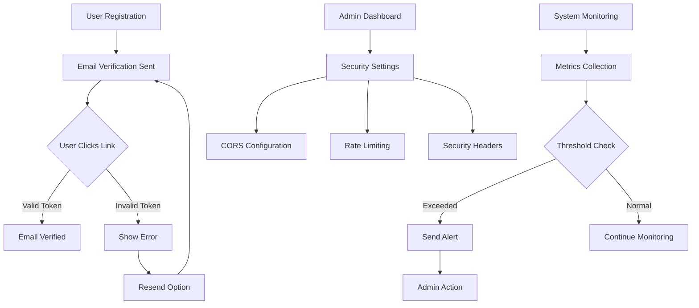

## 1. Product Overview
This is a production-ready application deployment system that ensures enterprise-grade security, reliability, and performance. The system provides comprehensive CORS configuration, email verification, health monitoring, database management, security hardening, and logging capabilities for modern web applications.

The platform solves critical production deployment challenges by providing automated security configurations, monitoring systems, and scalable infrastructure components that ensure application reliability and user trust.

## 2. Core Features

### 2.1 User Roles
| Role | Registration Method | Core Permissions |
|------|---------------------|------------------|
| End User | Email verification required | Access application features, verified email status |
| System Admin | Manual setup | Configure security settings, monitor system health, manage deployments |
| Developer | API key authentication | Access monitoring APIs, configure rate limits, view logs |

### 2.2 Feature Module
Our production-ready application consists of the following main components:

1. **Security Configuration Hub**: CORS policies, security headers, rate limiting, CSRF protection
2. **Email Verification System**: Token generation, email templates, verification endpoints, resend functionality
3. **Health Monitoring Dashboard**: System metrics, health checks, alerting, notifications
4. **Database Management**: Migration system, connection pooling, backup strategy, production configuration
5. **Environment Configuration**: Secure credential management, environment validation, documentation
6. **Logging & Error Tracking**: Structured logging, error tracking, log rotation, alerting

### 2.3 Page Details
| Page Name | Module Name | Feature description |
|-----------|-------------|---------------------|
| Health Dashboard | System Overview | Display real-time system metrics, server status, response times, error rates |
| Health Dashboard | Alert Management | Show active alerts, configure thresholds, manage notification channels |
| Email Verification | Verification Page | Handle email verification tokens, display success/failure messages, redirect users |
| Email Verification | Resend Email | Provide interface to request new verification email, validate user input |
| Admin Configuration | CORS Settings | Configure allowed domains, headers, methods, preflight settings |
| Admin Configuration | Security Settings | Manage rate limits, security headers, CSRF protection, cookie settings |
| Admin Configuration | Environment Variables | View and manage production environment variables, validate configurations |
| Admin Configuration | Database Management | Execute migrations, monitor connection pool, configure backup schedules |
| Admin Configuration | Logging Dashboard | View system logs, configure log levels, manage retention policies |
| API Documentation | Security Endpoints | Document CORS configuration, rate limiting, security header APIs |
| API Documentation | Verification Endpoints | Document email verification, token management, resend functionality |
| API Documentation | Health Monitoring | Document health check endpoints, metrics collection, alerting APIs |

## 3. Core Process

### User Verification Flow
1. User registers with email → System sends verification email with branded template
2. User clicks verification link → Token validated against database
3. Success: User email verified, redirected to application
4. Failure: Display error message, offer resend option

### Security Configuration Flow
1. Admin accesses configuration panel → Reviews current security settings
2. Updates CORS policies → Validates domain configurations
3. Configures rate limits → Sets appropriate thresholds
4. Applies security headers → Tests configuration effectiveness

### Health Monitoring Flow
1. System continuously monitors metrics → Collects performance data
2. Thresholds exceeded → Triggers alert notifications
3. Admin receives notification → Reviews detailed metrics
4. Takes corrective action → System returns to healthy state

## 4. User Interface Design

### 4.1 Design Style
- **Primary Colors**: Professional blue (#2563eb) for primary actions, green (#10b981) for success states
- **Secondary Colors**: Gray (#6b7280) for secondary text, red (#ef4444) for errors/alerts
- **Button Style**: Modern rounded corners (8px radius), subtle shadows, clear hover states
- **Font**: Inter font family, 16px base size with clear hierarchy (14px, 18px, 24px, 32px)
- **Layout**: Card-based design with consistent spacing (8px grid system), top navigation
- **Icons**: Heroicons for consistency, outlined style for clarity

### 4.2 Page Design Overview
| Page Name | Module Name | UI Elements |
|-----------|-------------|-------------|
| Health Dashboard | Metrics Cards | Clean card layout with real-time numbers, sparkline graphs, status indicators |
| Health Dashboard | Alert Panel | Color-coded alert cards with severity levels, dismissible notifications |
| Email Verification | Success Page | Centered success message with checkmark icon, clear next steps |
| Email Verification | Error Page | Clear error explanation, prominent resend button, support contact |
| Admin Configuration | Settings Panel | Tabbed interface, form inputs with validation, save indicators |
| Admin Configuration | Database Panel | Migration status table, connection pool metrics, backup schedule display |
| Admin Configuration | Logs Panel | Searchable log viewer, filter options, export functionality |

### 4.3 Responsiveness
- **Desktop-First**: Optimized for 1920x1080 and larger displays
- **Mobile Adaptive**: Responsive breakpoints at 768px and 480px
- **Touch Optimized**: Larger tap targets (44px minimum) on mobile devices
- **Performance**: Lazy loading for dashboard widgets, optimized for 3G connections