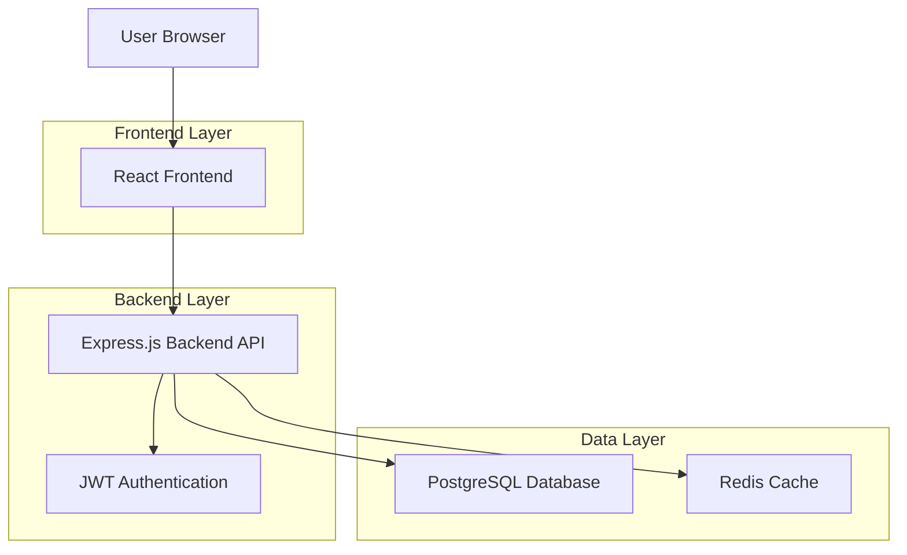
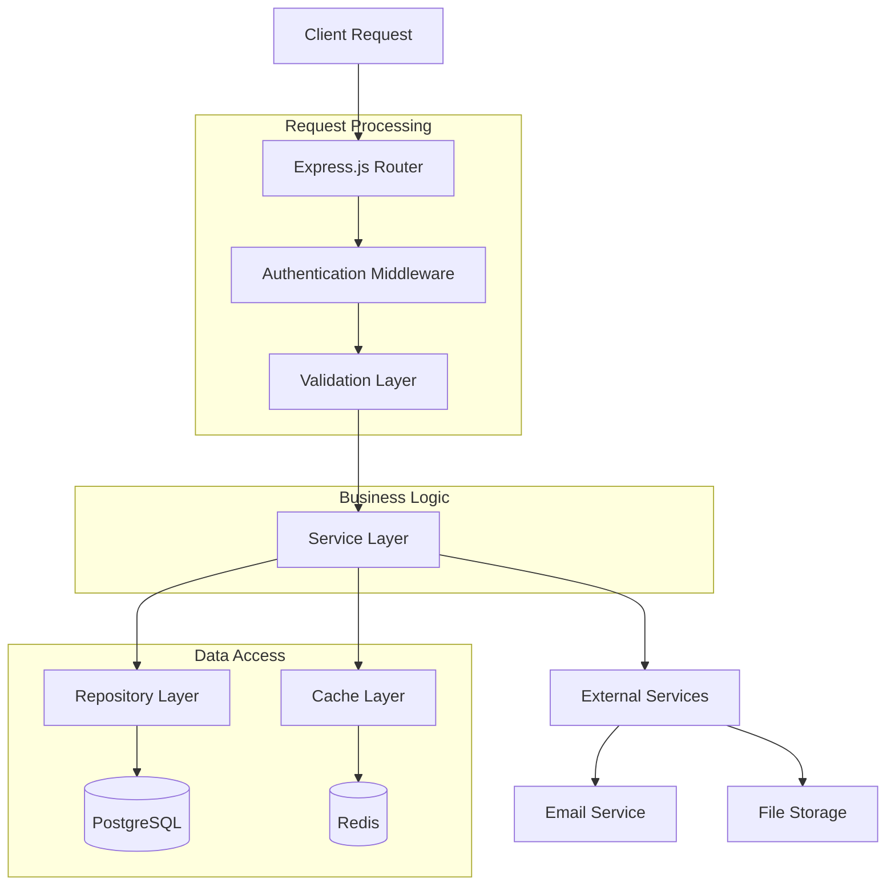
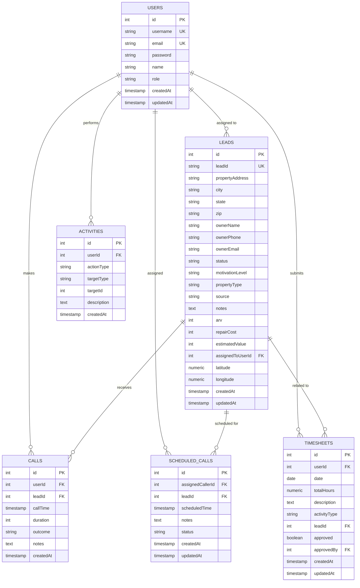

## 1. Architecture Design



## 2. Technology Description

- **Frontend**: React@18 + TypeScript + TailwindCSS@3 + Vite
- **Backend**: Express.js@4 + TypeScript + Node.js
- **Database**: PostgreSQL with Drizzle ORM
- **Authentication**: JWT tokens with express-session
- **State Management**: React Query for server state, Context API for client state
- **UI Components**: Radix UI components + custom components
- **Initialization Tool**: Vite (already configured)

## 3. Route Definitions

| Route | Purpose | Authentication Required |
|-------|---------|----------------------|
| `/` | Login page | No |
| `/login` | Alternative login route | No |
| `/signup` | User registration | No |
| `/password-recovery` | Password reset request | No |
| `/reset-password/:token` | Password reset form | No |
| `/dashboard` | Main dashboard | Yes |
| `/leads` | Leads list view | Yes |
| `/leads/:id` | Individual lead details | Yes |
| `/leads/new` | Create new lead form | Yes |
| `/leads/:id/edit` | Edit lead form | Yes |
| `/team` | Team management | Yes (Admin only) |
| `/reports` | Analytics dashboard | Yes |
| `/settings` | User settings | Yes |
| `/profile` | User profile | Yes |

## 4. API Definitions

### 4.1 Authentication APIs

**Login**
```
POST /api/auth/login
```

Request:
```json
{
  "email": "user@example.com",
  "password": "securepassword123"
}
```

Response:
```json
{
  "success": true,
  "token": "eyJhbGciOiJIUzI1NiIsInR5cCI6IkpXVCJ9...",
  "user": {
    "id": 1,
    "name": "John Doe",
    "email": "user@example.com",
    "role": "caller"
  }
}
```

**Register**
```
POST /api/auth/register
```

Request:
```json
{
  "name": "Jane Smith",
  "email": "jane@example.com",
  "password": "securepassword123",
  "role": "caller"
}
```

**Password Recovery**
```
POST /api/auth/password-recovery
```

Request:
```json
{
  "email": "user@example.com"
}
```

**Reset Password**
```
POST /api/auth/reset-password
```

Request:
```json
{
  "token": "reset-token-here",
  "newPassword": "newsecurepassword123"
}
```

### 4.2 Leads APIs

**Get All Leads**
```
GET /api/leads?page=1&limit=10&status=new&sort=createdAt&order=desc
```

Response:
```json
{
  "success": true,
  "data": [
    {
      "id": 1,
      "leadId": "LD-2025-0001",
      "propertyAddress": "123 Main St",
      "city": "Anytown",
      "state": "CA",
      "zip": "12345",
      "ownerName": "John Owner",
      "ownerPhone": "555-123-4567",
      "status": "new",
      "motivationLevel": "high",
      "assignedToUserId": 2,
      "createdAt": "2025-01-01T00:00:00Z"
    }
  ],
  "total": 100,
  "page": 1,
  "totalPages": 10
}
```

**Create Lead**
```
POST /api/leads
```

Request:
```json
{
  "propertyAddress": "456 Oak Ave",
  "city": "Somewhere",
  "state": "TX",
  "zip": "67890",
  "ownerName": "Jane Owner",
  "ownerPhone": "555-987-6543",
  "ownerEmail": "jane@example.com",
  "status": "new",
  "motivationLevel": "medium",
  "propertyType": "single-family",
  "source": "cold-call",
  "notes": "Interested in selling quickly"
}
```

**Update Lead**
```
PUT /api/leads/:id
```

**Delete Lead**
```
DELETE /api/leads/:id
```

**Bulk Update**
```
PUT /api/leads/bulk
```

Request:
```json
{
  "ids": [1, 2, 3],
  "updates": {
    "status": "follow-up",
    "assignedToUserId": 2
  }
}
```

### 4.3 Team Management APIs

**Get Team Members**
```
GET /api/team
```

**Create Team Member**
```
POST /api/team
```

**Update Team Member**
```
PUT /api/team/:id
```

**Delete Team Member**
```
DELETE /api/team/:id
```

### 4.4 Reports APIs

**Get Dashboard Metrics**
```
GET /api/reports/dashboard
```

Response:
```json
{
  "success": true,
  "data": {
    "totalLeads": 150,
    "newLeads": 25,
    "conversionRate": 12.5,
    "activeDeals": 8,
    "totalRevenue": 1250000,
    "teamPerformance": [
      {
        "userId": 1,
        "name": "John Doe",
        "totalCalls": 45,
        "leadsConverted": 3,
        "revenue": 450000
      }
    ]
  }
}
```

## 5. Server Architecture Diagram



## 6. Data Model

### 6.1 Database Schema



### 6.2 Data Definition Language

**Users Table**
```sql
CREATE TABLE users (
    id SERIAL PRIMARY KEY,
    username VARCHAR(255) UNIQUE NOT NULL,
    email VARCHAR(255) UNIQUE NOT NULL,
    password VARCHAR(255) NOT NULL,
    name VARCHAR(255),
    role VARCHAR(20) DEFAULT 'caller' CHECK (role IN ('admin', 'acquisitions', 'caller', 'investor')),
    created_at TIMESTAMP WITH TIME ZONE DEFAULT NOW() NOT NULL,
    updated_at TIMESTAMP WITH TIME ZONE
);

-- Indexes
CREATE INDEX idx_users_email ON users(email);
CREATE INDEX idx_users_role ON users(role);
```

**Leads Table**
```sql
CREATE TABLE leads (
    id SERIAL PRIMARY KEY,
    lead_id VARCHAR(50) UNIQUE NOT NULL,
    property_address VARCHAR(255) NOT NULL,
    city VARCHAR(100) NOT NULL,
    state VARCHAR(50) NOT NULL,
    zip VARCHAR(20) NOT NULL,
    owner_name VARCHAR(255) NOT NULL,
    owner_phone VARCHAR(50),
    owner_email VARCHAR(255),
    status VARCHAR(50) DEFAULT 'new',
    motivation_level VARCHAR(20) DEFAULT 'unknown',
    property_type VARCHAR(50) DEFAULT 'single-family',
    source VARCHAR(50) DEFAULT 'other',
    notes TEXT,
    arv INTEGER,
    repair_cost INTEGER,
    estimated_value INTEGER,
    assigned_to_user_id INTEGER REFERENCES users(id),
    latitude NUMERIC(10, 8),
    longitude NUMERIC(11, 8),
    created_at TIMESTAMP WITH TIME ZONE DEFAULT NOW() NOT NULL,
    updated_at TIMESTAMP WITH TIME ZONE DEFAULT NOW()
);

-- Indexes
CREATE INDEX idx_leads_status ON leads(status);
CREATE INDEX idx_leads_assigned_to ON leads(assigned_to_user_id);
CREATE INDEX idx_leads_created_at ON leads(created_at DESC);
```

**Calls Table**
```sql
CREATE TABLE calls (
    id SERIAL PRIMARY KEY,
    user_id INTEGER NOT NULL REFERENCES users(id),
    lead_id INTEGER NOT NULL REFERENCES leads(id),
    call_timestamp TIMESTAMP WITH TIME ZONE DEFAULT NOW() NOT NULL,
    duration_seconds INTEGER,
    outcome VARCHAR(50),
    notes TEXT,
    created_at TIMESTAMP WITH TIME ZONE DEFAULT NOW() NOT NULL
);

-- Indexes
CREATE INDEX idx_calls_user_id ON calls(user_id);
CREATE INDEX idx_calls_lead_id ON calls(lead_id);
CREATE INDEX idx_calls_timestamp ON calls(call_timestamp DESC);
```

## 7. Security Implementation

### 7.1 Authentication & Authorization
- JWT tokens with 24-hour expiration
- Refresh token mechanism for extended sessions
- Role-based access control (RBAC) for all endpoints
- Password hashing with bcrypt (12 rounds)
- Rate limiting on authentication endpoints

### 7.2 Data Protection
- HTTPS enforcement in production
- Input validation and sanitization
- SQL injection prevention via parameterized queries
- XSS protection with proper output encoding
- CSRF protection for state-changing operations

### 7.3 Security Headers
```javascript
app.use(helmet({
  contentSecurityPolicy: {
    directives: {
      defaultSrc: ["'self'"],
      styleSrc: ["'self'", "'unsafe-inline'"],
      scriptSrc: ["'self'"],
      imgSrc: ["'self'", "data:", "https:"],
    },
  },
  hsts: {
    maxAge: 31536000,
    includeSubDomains: true,
    preload: true
  }
}));
```

## 8. Performance Optimization

### 8.1 Database Optimization
- Proper indexing on frequently queried columns
- Query optimization with EXPLAIN analysis
- Connection pooling with pg-pool
- Database connection limits based on server resources

### 8.2 Caching Strategy
- Redis for session storage
- Query result caching for expensive operations
- Static asset caching with proper cache headers
- CDN integration for production deployments

### 8.3 Frontend Optimization
- Code splitting with React.lazy()
- Image optimization and lazy loading
- Bundle size optimization
- Service worker for offline functionality

## 9. Monitoring & Logging

### 9.1 Application Logging
- Winston logger with different log levels
- Structured logging in JSON format
- Log rotation to prevent disk space issues
- Centralized logging in production

### 9.2 Performance Monitoring
- Application Performance Monitoring (APM) integration
- Database query performance tracking
- API response time monitoring
- Error rate tracking and alerting

### 9.3 Health Checks
- `/health` endpoint for load balancer checks
- Database connectivity monitoring
- External service dependency checks
- Automated alerting for system issues

## 10. Deployment Architecture

### 10.1 Production Environment
- Load balancer (Nginx/CloudFlare)
- Multiple application server instances
- PostgreSQL with read replicas
- Redis cluster for high availability
- CDN for static assets

### 10.2 Backup Strategy
- Daily automated database backups
- Point-in-time recovery capability
- Cross-region backup storage
- Regular backup restoration testing
- Application code version control with Git

### 10.3 CI/CD Pipeline
- Automated testing on pull requests
- Build and deployment automation
- Database migration management
- Rollback procedures
- Environment-specific configurations